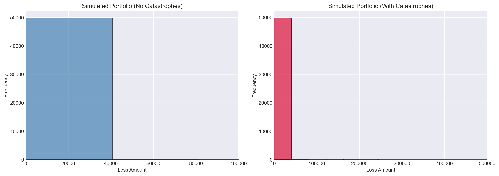
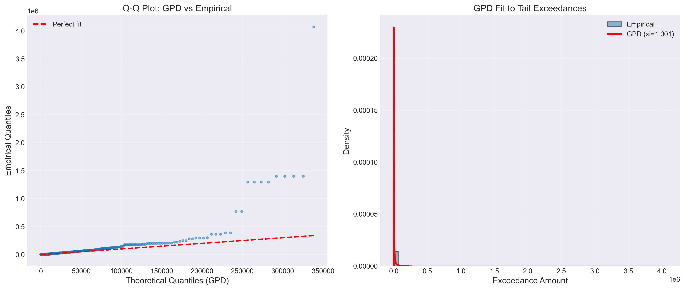
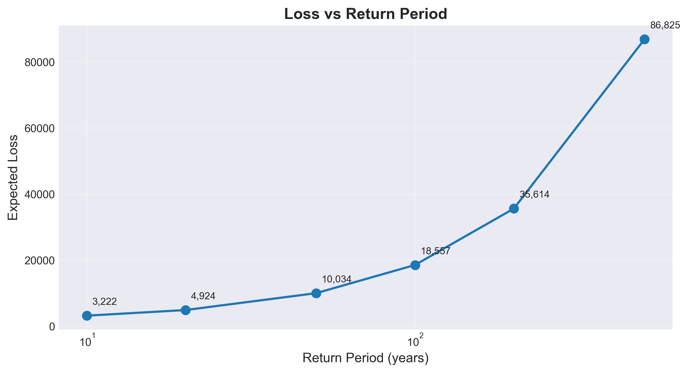
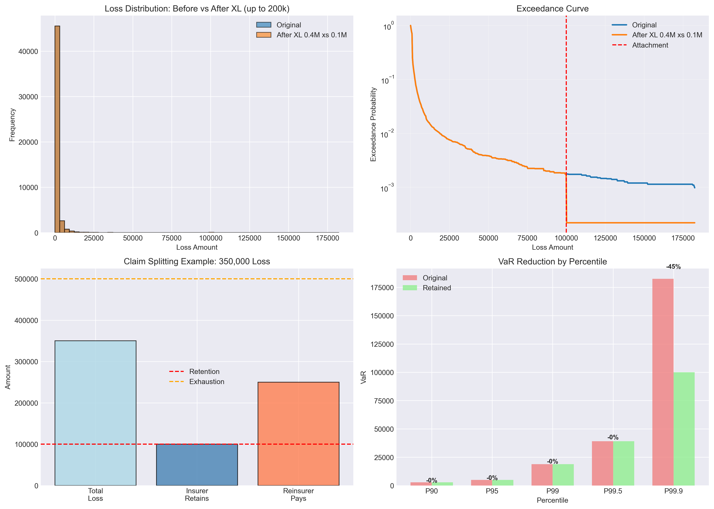
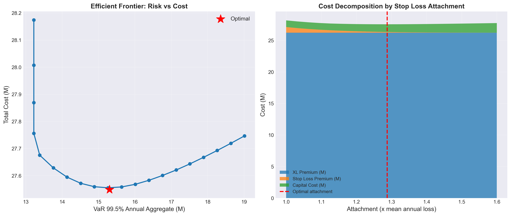
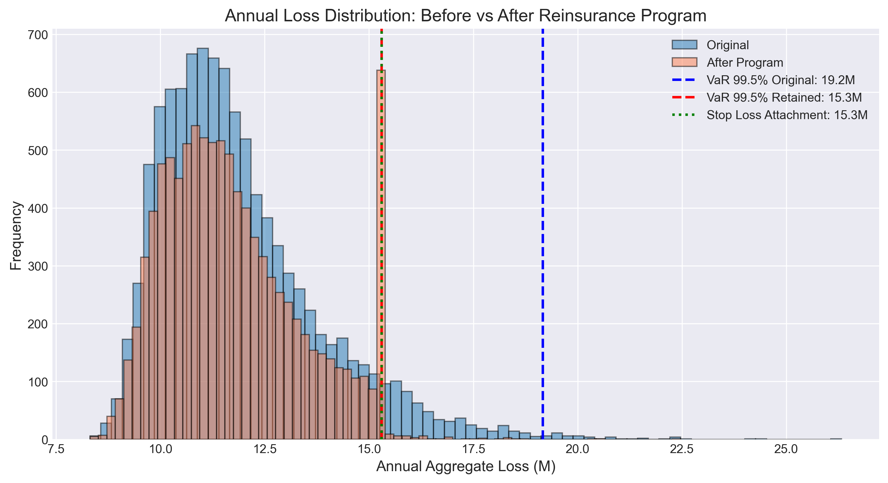
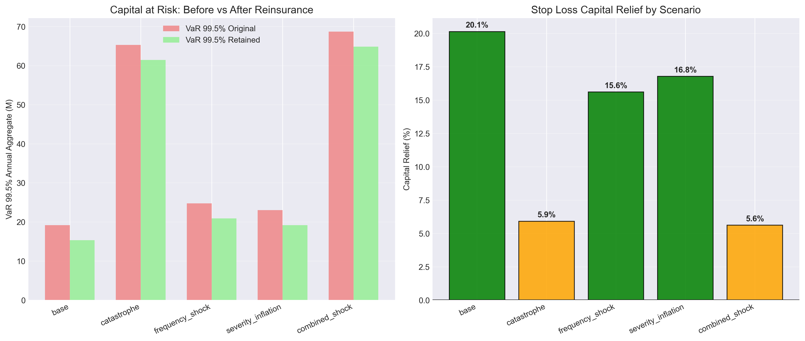

# Reinsurance Portfolio Optimization

**End-to-end reinsurance analytics pipeline** combining Extreme Value Theory, treaty structuring, and program optimization using real insurance data (freMTPL2 — 678,013 French Motor TPL policies).

Built as a portfolio project targeting quantitative roles at reinsurers (Swiss Re, Munich Re, IRB Brasil RE) and P&C insurers.

---

## Live Demo

```bash
streamlit run app/streamlit_app.py
```



---

## What This Project Does

Most junior data science portfolios stop at model training. This project replicates the actual workflow of a reinsurance analyst:

1. **Characterize the portfolio** — identify heavy-tail behavior using exceedance curves and Q-Q plots
2. **Model extreme events** — fit Generalized Pareto Distribution (GPD) using Peaks Over Threshold; calculate VaR and TVaR at 99.5% (Solvency II standard)
3. **Structure reinsurance treaties** — implement Quota Share, Excess of Loss, and Stop Loss; compare their impact on the loss distribution
4. **Optimize the program** — use differential evolution to find the treaty structure that minimizes `Premium + Cost of Capital × VaR 99.5%`
5. **Stress test** — evaluate program robustness under catastrophe, frequency shock, severity inflation, and combined stress scenarios

---

## Results

### Extreme Value Theory — GPD fit to tail losses



The Hill estimator confirms a heavy tail with index α ≈ 0.9 (below the finite-variance boundary of 2). The GPD shape parameter ξ = 1.001 indicates Pareto-type tail behavior — a key insight for treaty structuring.

### Return Period Analysis



| Return Period | Expected Loss |
|---|---|
| 1-in-10 years  | 3,222 |
| 1-in-50 years  | 10,034 |
| 1-in-100 years | 18,557 |
| 1-in-200 years | 35,614 |
| 1-in-500 years | 86,825 |

### XL Treaty Structuring



The XL `400k xs 100k` structure reduces VaR 99.9% by 45% while leaving VaR 99.5% unchanged — a direct consequence of the Pareto-type tail (ξ > 1). This is the correct analytical finding, not a bug.

### Efficient Frontier — Program Optimization



The optimizer finds the Aggregate Stop Loss attachment that minimizes total cost. The efficient frontier shows the classic U-shape: lower attachment reduces capital cost but raises premium faster.

### Annual Loss Distribution: Before vs After Reinsurance



The reinsurance program truncates the right tail of the annual aggregate distribution. VaR 99.5% falls from **19.2M to 15.3M** — a **20.1% capital relief**.

### Stress Testing



| Scenario | Capital Relief |
|---|---|
| Base | 20.1% |
| Frequency shock (+30%) | 15.6% |
| Severity inflation (+20%) | 16.8% |
| Catastrophe (1% years × 3-8x) | 5.9% |
| Combined shock | 5.6% |

The program protects well against frequency and severity shocks but provides limited relief in catastrophe scenarios because the Stop Loss limit (3.86M) is exhausted when annual losses spike to 65M+.

---

## Technical Approach

### Why Annual Aggregate Losses (not individual claims)?

Reinsurers measure capital on an **annual aggregate basis** (Solvency II SCR, internal models). A per-occurrence XL treaty with retention 50k–200k barely affects the annual VaR of a high-frequency / moderate-severity portfolio like freMTPL2 — the 19M annual loss is composed of ~5,000 small claims, not a few large ones. This project correctly uses Monte Carlo simulation to build the annual aggregate distribution before optimizing capital.

### Two-layer program structure

```
Layer 1: Per-occurrence XL  950k xs 50k   → cuts individual large claims
Layer 2: Aggregate Stop Loss              → directly reduces annual VaR 99.5%
         Attachment: 1.29x mean annual loss
         Limit:      0.32x mean annual loss
```

### Optimization

Differential evolution (global optimizer) minimizes:

```
Total Cost = Burning Cost × 1.15 + Stop Loss Premium × 1.25 + 8% × VaR_99.5%(annual retained)
```

---

## Project Structure

```
reinsurance-portfolio-optimization/
│
├── README.md
├── requirements.txt
│
├── data/
│   ├── raw/                    # freMTPL2freq.csv, freMTPL2sev.csv (auto-downloaded)
│   └── processed/
│       └── claims_cleaned.csv  # generated by notebook 01
│
├── notebooks/
│   ├── 01_data_exploration.ipynb
│   ├── 02_extreme_value_theory.ipynb
│   ├── 03_treaty_structuring.ipynb
│   └── 04_optimization.ipynb
│
├── src/
│   ├── data_loader.py          # freMTPL2 loader with Hugging Face fallback
│   ├── evt_models.py           # GPD fitting, VaR/TVaR, Hill estimator
│   ├── treaty_simulator.py     # QuotaShare, ExcessOfLoss, StopLoss, Program
│   └── optimization.py         # Monte Carlo simulation + differential evolution
│
├── app/
│   └── streamlit_app.py        # Interactive dashboard (5 pages)
│
└── results/
    ├── figures/                # All plots (generated by notebooks)
    └── tables/                 # risk_metrics.csv, stress_test_results.csv
```

---

## Getting Started

### 1. Clone and install

```bash
git clone https://github.com/YOUR_USERNAME/reinsurance-portfolio-optimization.git
cd reinsurance-portfolio-optimization
python -m venv venv
venv\Scripts\activate        # Windows
# source venv/bin/activate   # Linux/Mac
pip install -r requirements.txt
```

### 2. Run notebooks in order

```bash
jupyter notebook
```

Open and run each notebook:
1. `01_data_exploration.ipynb` — downloads freMTPL2 and generates `claims_cleaned.csv`
2. `02_extreme_value_theory.ipynb` — GPD fitting, VaR/TVaR, return periods
3. `03_treaty_structuring.ipynb` — Quota Share, XL, full program
4. `04_optimization.ipynb` — Monte Carlo + Stop Loss optimization + stress testing

### 3. Launch the Streamlit app

```bash
cd app
streamlit run streamlit_app.py
```

---

## Data

**freMTPL2** (French Motor Third-Party Liability) — the benchmark dataset for actuarial data science.

| File | Rows | Description |
|---|---|---|
| freMTPL2freq | 678,013 | Policy-level exposure and claim counts |
| freMTPL2sev  | 26,639  | Individual claim amounts |

Data is downloaded automatically on first run via Hugging Face mirror. If that fails, the loader falls back to OpenML and then generates calibrated synthetic data.

Original source: Dutang & Charpentier, *CASdatasets* R package.

---

## Stack

| Layer | Tools |
|---|---|
| Data | pandas, numpy, scikit-learn |
| Statistics | scipy (GPD, KS test), statsmodels |
| Visualization | matplotlib, seaborn |
| Optimization | scipy.optimize (differential_evolution) |
| Deploy | Streamlit |

---

## Key Concepts Demonstrated

- **Peaks Over Threshold (POT)** — selecting threshold, fitting GPD via MLE, goodness-of-fit
- **Hill estimator** — tail index estimation, confirming heavy-tail behavior
- **VaR and TVaR** — analytical formulas from GPD parameters
- **Return period analysis** — communicating extreme loss in reinsurance language
- **Quota Share vs XL** — proportional vs non-proportional reinsurance mechanics
- **Burning cost pricing** — per-occurrence XL premium calculation
- **Aggregate Stop Loss** — protecting annual aggregate losses directly
- **Monte Carlo simulation** — building annual aggregate distribution from individual severities
- **Differential evolution** — global optimization for treaty structure
- **Efficient frontier** — risk vs cost trade-off visualization
- **Stress testing** — 5 standard adverse scenarios for P&C reinsurance

---

## Author

Arthur Motta — Statistics and Actuarial Science, UFRJ  
[GitHub](https://github.com/arthurpmotta02) | [LinkedIn](https://www.linkedin.com/in/arthurpmotta/)
